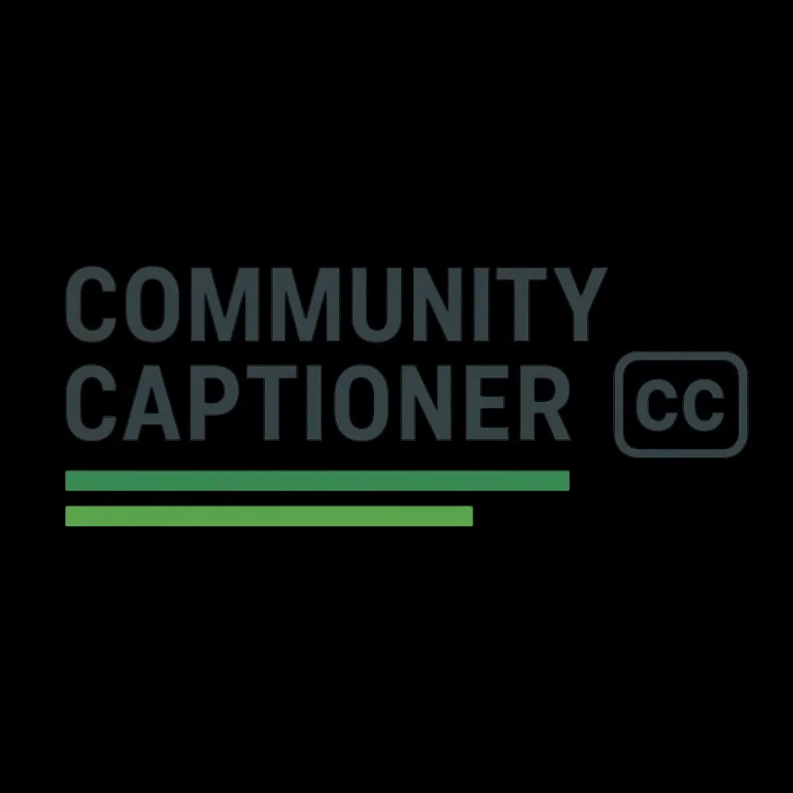

# Community Captioner v2

**Free, open-source live captioning for community media.**



## Features

### 🎙️ Dual Captioning Modes
- **⚡ Web Speech API** - Real-time (~200ms), requires Chrome/Edge + internet
- **🎯 Whisper** - Accurate local AI, works offline, 2-4s latency

### ✨ Caption Engine (RAG)
- Auto-corrects local names, places, and organizations
- "Brooklyn" → "Brookline", "bernard green" → "Bernard Greene"
- Portable engines - download/upload to share correction rules
- Real-time corrections dashboard

### 📝 Session Recording
- Timestamps for every caption
- Live correction tracking
- Export to SRT, VTT, TXT, JSON
- Generate summaries and highlights

### 📺 OBS Integration
- Browser source overlay
- Customizable styling
- Local network support

---

## Quick Start

```bash
# Run the server
python3 start-server.py

# Opens http://localhost:8080
```

### Enable Whisper (Optional)

```bash
pip3 install faster-whisper sounddevice numpy

# Mac may need:
brew install portaudio

# Linux may need:
sudo apt install portaudio19-dev
```

---

## Usage

### 1. Choose Your Mode

| Mode | Speed | Accuracy | Requirements |
|------|-------|----------|--------------|
| ⚡ Web Speech | ~200ms | Good | Chrome + Internet |
| 🎯 Whisper | 2-4s | Better | Local install |

### 2. Enable Caption Engine

Toggle the **✨ Caption Engine** to auto-correct:
- People's names (Bernard Greene, Todd Kirrane)
- Places (Brookline, Coolidge Corner)
- Organizations (Select Board, BIG)

Click **Load Brookline Defaults** to add 30+ local terms.

### 3. Record Session

Click **● Start Recording** to:
- Timestamp every caption
- Track all corrections
- Enable exports

### 4. Export

After recording, export as:
- **SRT** - Subtitle file for video
- **VTT** - Web captions
- **TXT** - Plain transcript
- **JSON** - Full data with corrections

---

## Portable Caption Engines

### Download Engine
1. Go to **Engine** tab
2. Click **⬇️ Download**
3. Save the `.json` file

### Upload Engine
1. Go to **Engine** tab
2. Click **⬆️ Upload**
3. Select a `.json` engine file

Share engines with other organizations to give them your correction rules!

---

## OBS Setup

1. Copy the overlay URL: `http://localhost:8080?overlay=true`
2. In OBS: **Sources** → **+** → **Browser**
3. Paste URL, set 1920×1080
4. Position at bottom of scene

---

## API Endpoints

### Caption
- `GET /api/caption` - Current caption state
- `POST /api/caption` - Send caption text

### Engine
- `GET /api/engine/status` - Engine stats
- `GET /api/engine/terms` - List terms
- `GET /api/engine/export` - Download engine
- `POST /api/engine/import` - Upload engine
- `POST /api/engine/defaults` - Load Brookline terms

### Session
- `POST /api/session/start` - Start recording
- `POST /api/session/stop` - Stop recording
- `GET /api/session/export/srt` - Export SRT
- `GET /api/session/export/vtt` - Export VTT
- `GET /api/session/export/txt` - Export transcript
- `GET /api/session/summary` - Generate summary

### Whisper
- `GET /api/whisper/status` - Whisper status
- `GET /api/whisper/devices` - List microphones
- `POST /api/whisper/load` - Load model
- `POST /api/whisper/start` - Start listening
- `POST /api/whisper/stop` - Stop listening

---

## File Structure

```
community-captioner/
├── start-server.py     # Main server
├── index.html          # Control panel
├── overlay.html        # OBS overlay
├── context-data/       # Engine state
├── sessions/           # Recorded sessions
├── engines/            # Saved engines
└── big-logo.png        # BIG logo
```

---

## Credits

A community AI project from [Brookline Interactive Group](https://brooklineinteractive.org)

Designed and developed by [Stephen Walter](https://weirdmachine.org)

Licensed under CC BY-SA 4.0
